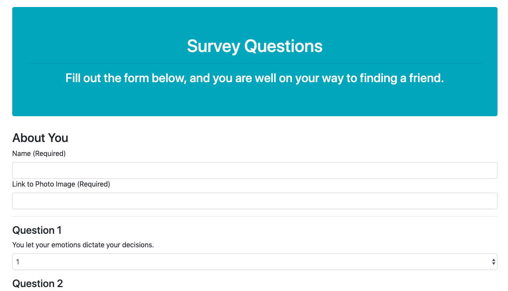

# FriendFinder
Homework assignment for module #13 (U.T. Coding Bootcamp)

## Motivation
I created this web app in order to gain a better understanding of how to create my own server-side APIs using Express.js. The app allows the user to find a new friend by comparing the answers stored on the server. See instructions and link below to use! 

[Click here to use the app.](https://frozen-mountain-97228.herokuapp.com/)

## How to Use
Click "Go to survey" on the homepage. Then fill out the short form at the top of the survey questionaire page. After this, read each of the ten questions, and select a number (1-5) to answer how true that statement is of you( 1 being not true at all and 5 being absolutely true). 

After you submit your results, the app will select a friend that has similar results. The app is assuming you will be friends with someone who answered the questions most similarily to you. Good luck!

## Process
I first created two HTML files for the two pages (the home page + survey page). After this, I created a simple file with an array containing data for "friends". I hard-coded the data for three "friends," so that I could perform tests. I then created a server and established a local connection. I was able to test my app by running "node server.js" on my local PORT. 

Once I had the server up and running, I then created my HTML routes. A route is basically a URL combined with a method. The HTML routes direct the user the user to the appropriate page. In this case, "/" sends the user to the homepage, and "/survey" sends the user to the questionaire. After I created the routes, I updated the <a> tags in my HTML pages.

Next, I created my API routes. The API routes are for our data to help determine what data the user sees and also post data back to the server from the user. In this case, I wanted to post the user's results from the survey to my array. I then needed to create a function that would take the user's scores and compare them with all of the other scores in the array. This was the most challenging aspect of the project, and I had to do a lot of research/look at others' code online in order to get it to work! 

Once I had this function working, I wrote some jQuery in my HTML survey page, so that the data could be displayed back to the user. I took the values from the user inputs and made an AJAX call to post the user data to the correct API route. The user data is run through the function I wrote, and the response data (name + photo) is returned back in modal form. 

### Portfolio 
**If you'd like to see more of my work, check out my portfolio at https://mollyclaire.github.io/Responsive-Portfolio/**
